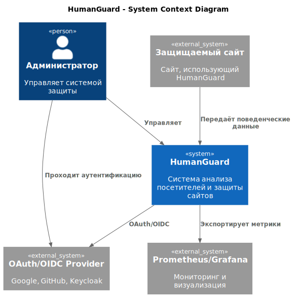
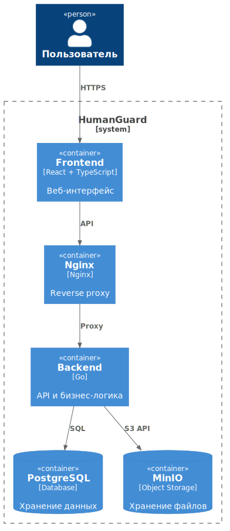
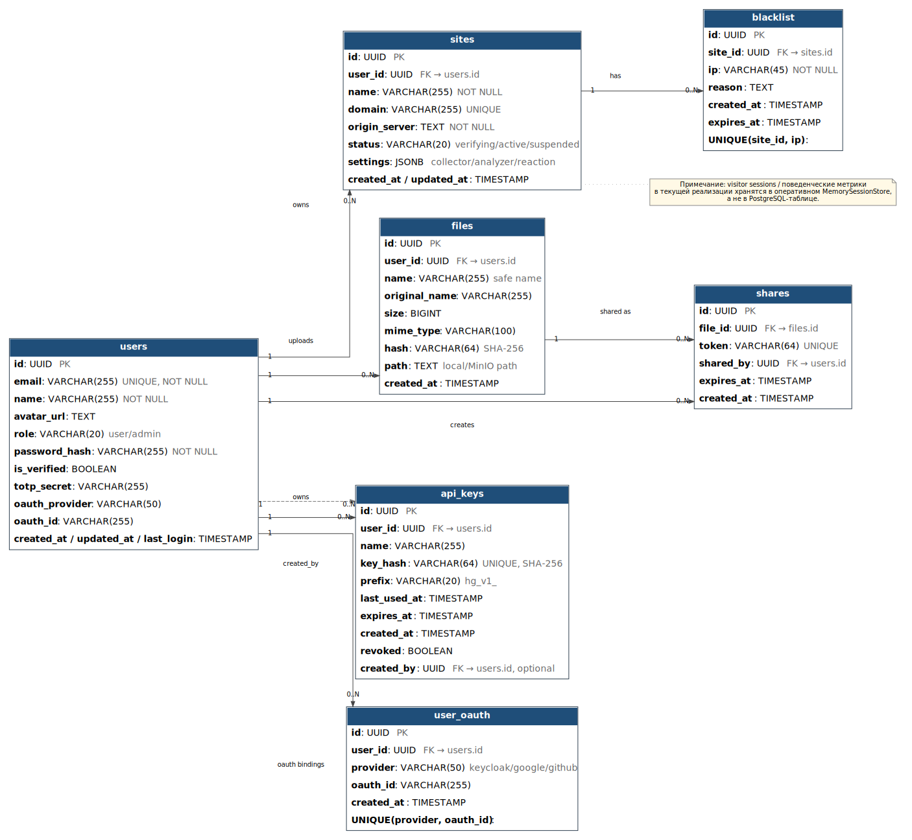
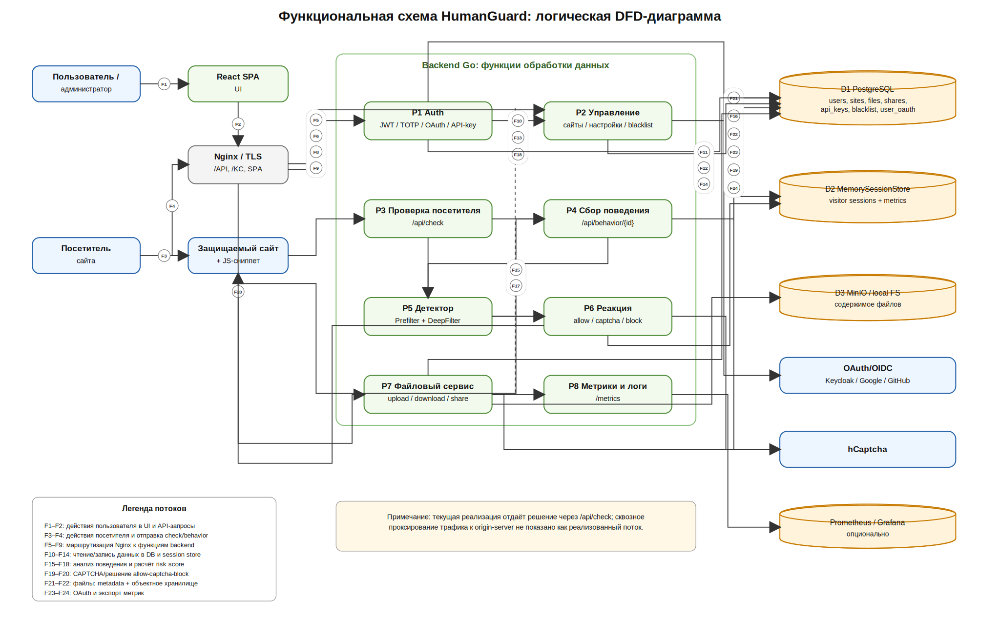

# Описание системы

## Структура ПО

В состав программной системы HumanGuard входят следующие компоненты:

1. **HumanGuard Frontend** — клиентское веб-приложение, реализованное на React и TypeScript. Предоставляет пользовательский интерфейс для управления сайтами, файлами, API-ключами, настройками безопасности и административными функциями.

2. **HumanGuard Backend** — серверное приложение, реализованное на языке Go. Обеспечивает обработку HTTP-запросов, аутентификацию пользователей, управление сайтами, анализ поведенческих метрик, вычисление уровня риска и работу с файловым хранилищем.

3. **Модуль аутентификации** — подсистема backend-приложения, реализующая регистрацию пользователей, JWT-аутентификацию, двухфакторную аутентификацию TOTP и OAuth/OIDC-аутентификацию через внешних провайдеров.

4. **Модуль детекции** — подсистема анализа посетительских сессий, выполняющая оценку риска на основе поведенческих характеристик и fingerprint-признаков клиента.

5. **PostgreSQL** — реляционная система управления базами данных, используемая для хранения пользователей, сайтов, файлов, API-ключей и информации о посетительских сессиях.

6. **MinIO** — объектное хранилище S3-совместимого типа для хранения пользовательских файлов.

7. **Nginx** — веб-сервер и обратный прокси, обеспечивающий маршрутизацию запросов и TLS-терминацию.

8. **Prometheus** — система сбора и хранения эксплуатационных метрик приложения.

9. **Grafana** — система визуализации метрик и мониторинга состояния системы.

10. **OAuth/OIDC-провайдеры (Google, GitHub, Keycloak)** — используются для аутентификации пользователей через сторонние сервисы.

## Структурная схема ПО в нотации C4

Высокоуровневая архитектура HumanGuard представлена в нотации C4 на уровнях контекста и контейнеров.

### Уровень контекста

Диаграмма уровня контекста отражает взаимодействие HumanGuard с пользователями, защищаемыми сайтами, внешними сервисами аутентификации и средствами мониторинга.

### Уровень контейнеров

Диаграмма контейнеров демонстрирует внутреннюю структуру системы и взаимодействие между её основными компонентами.

## Схемы баз данных (ERD)

ERD-диаграмма отражает структуру основных сущностей HumanGuard и связи между ними в реляционной базе данных PostgreSQL. В качестве основной БД используется PostgreSQL: в ней хранятся пользователи, защищаемые сайты, настройки сайтов, сведения о файлах, публичных ссылках, API-ключах, OAuth-привязках и чёрных списках IP-адресов.

Основные сущности системы:

* users — учётные записи пользователей системы;
* sites — защищаемые сайты, добавленные пользователями;
* blacklist — IP-адреса, заблокированные для конкретного сайта;
* files — метаданные загруженных пользователями файлов;
* shares — временные публичные ссылки на файлы;
* api_keys — API-ключи пользователей для автоматизированного доступа;
* user_oauth — связи пользователей с OAuth/OIDC-провайдерами.

Связи между сущностями построены вокруг пользователя. Один пользователь может владеть несколькими сайтами, файлами и API-ключами. Каждый сайт может иметь собственный blacklist. Каждый файл может иметь несколько публичных ссылок. OAuth-привязки позволяют связать одну учётную запись HumanGuard с внешними провайдерами авторизации.

Отдельно в системе используется хранилище активных visitor-сессий MemorySessionStore. Оно не является таблицей PostgreSQL и хранится в памяти приложения, поэтому на ERD оно показано как логическое хранилище, а не как полноценная реляционная таблица. В нём содержатся активные сессии посетителей, поведенческие метрики, текущий risk score, статус блокировки и признаки показа CAPTCHA. Реальные таблицы PostgreSQL заданы в миграции проекта, а visitor-сессии реализованы отдельным in-memory storage.

## Функциональная схема ПО

DFD-диаграмма демонстрирует основные потоки данных между пользователями, посетителями защищаемого сайта, frontend-приложением, backend-модулями HumanGuard, хранилищами данных и внешними сервисами.

Внешними участниками схемы являются пользователь или администратор системы, посетитель защищаемого сайта, сам защищаемый сайт с установленным JS-сниппетом, OAuth/OIDC-провайдеры, hCaptcha и опциональная система мониторинга Prometheus/Grafana.

Основные процессы:

1. Работа пользователя через интерфейс.
2. Маршрутизация запросов через Nginx/TLS.
3. Аутентификация и авторизация.
4. Управление защищаемыми сайтами.
5. Проверка посетителя сайта.
6. Сбор поведенческих данных.
7. Анализ поведения и расчёт риска.
8. Применение реакции.
9. Работа с файлами.
10. Метрики и логирование.

Хранилища данных на схеме разделены по назначению:

1. PostgreSQL — основное реляционное хранилище пользователей, сайтов, файлов, API-ключей, blacklist и OAuth-связей;
2. MemorySessionStore — оперативное хранилище visitor-сессий и поведенческих метрик;
3. MinIO / local FS — объектное или локальное хранилище содержимого файлов.

